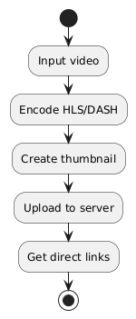

# WIP ⚠

## Adaptive Video Uploader

This application that encodes the video into various resolutions and bitrates for optimal viewing in all devices and network speeds and uploads it to the server. 

### Resources
https://ffmpeg.org/ffmpeg.html

https://medium.com/@paulgoll/hls-streaming-a-comprehensive-guide-2024-47c488d69b32